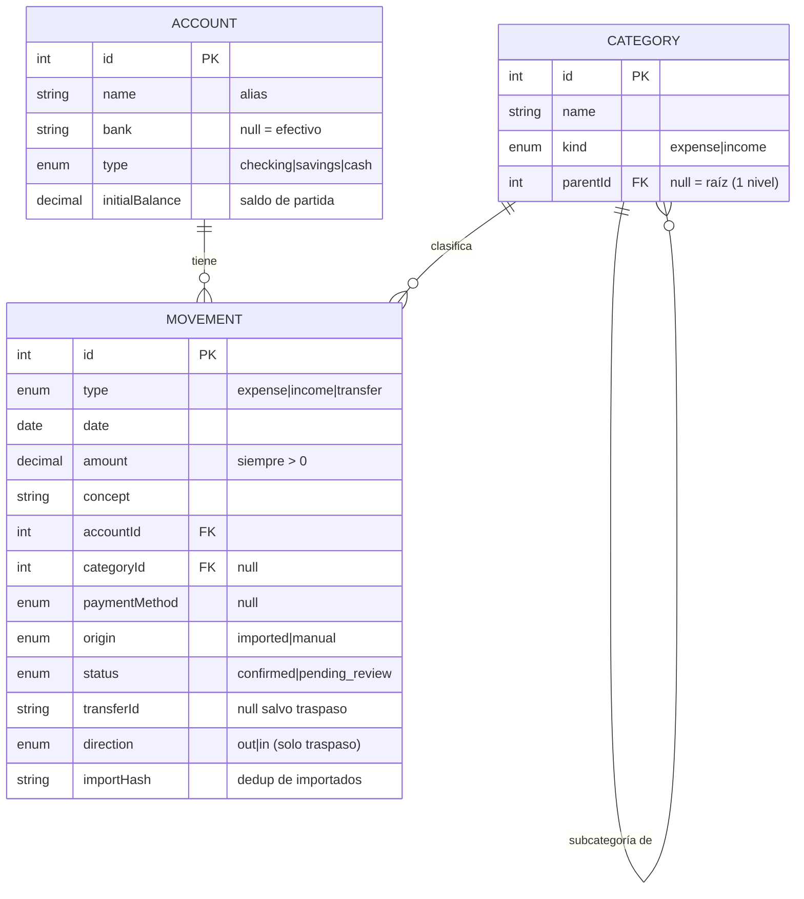

# Modelo de datos — propuesta v1 (flujo)

> **🚧 BORRADOR PARA REVISIÓN — todavía NO implementado.** Este documento es una
> propuesta del esquema de base de datos para que el humano lo revise **antes**
> de crear la feature 6. No es arquitectura decidida (eso vive en
> `architecture.md`) ni toca `prisma/schema.prisma`. Cuando estés conforme, se
> convierte en el `intent` de la feature 6 y se implementa por SDD.
>
> **Alcance v1:** solo el **flujo** (cuentas, movimientos, categorías). El
> **patrimonio e inversiones (idea #3)** se añade en una fase posterior **encima**
> de este núcleo, cuando este modelo esté aprobado. Las decisiones de producto que
> hay detrás están en `../../docs/ideas.md` §2 ("Modelo de datos del flujo").

## Diagrama de entidades



> El **traspaso** no es una FK: son **dos filas `MOVEMENT`** (`type = transfer`)
> que comparten el mismo `transferId` (una `direction = out` en la cuenta origen,
> otra `direction = in` en la destino). Es un enlace lógico, no una relación de
> Prisma.

## Esquema Prisma (ilustrativo — cómo quedaría)

```prisma
// ── Enums ────────────────────────────────────────────────
enum AccountType {
  checking      // cuenta corriente
  savings       // cuenta de ahorro
  cash          // efectivo
}

enum MovementType {
  expense       // gasto
  income        // ingreso
  transfer      // traspaso entre cuentas propias
}

enum MovementDirection {
  out           // sale de la cuenta (pierna origen del traspaso)
  in            // entra en la cuenta (pierna destino del traspaso)
}

enum CategoryKind {
  expense
  income
}

enum PaymentMethod {
  card           // tarjeta
  cash           // metálico
  bank_transfer  // transferencia
  direct_debit   // domiciliación
}

enum MovementOrigin {
  imported       // importado por la ingesta (idea #1)
  manual         // dado de alta a mano (efectivo, correcciones)
}

enum MovementStatus {
  confirmed
  pending_review // importado, pendiente de revisar antes de confirmar
}

// ── Modelos ──────────────────────────────────────────────
model Account {
  id             Int          @id @default(autoincrement())
  name           String       // alias, p.ej. "Bankinter nómina"
  bank           String?      // nombre del banco; null para la cuenta de efectivo
  type           AccountType  @default(checking)
  initialBalance Decimal      @default(0) @db.Decimal(10, 2)
  movements      Movement[]
  createdAt      DateTime     @default(now())
  updatedAt      DateTime     @updatedAt
}

model Category {
  id        Int          @id @default(autoincrement())
  name      String
  kind      CategoryKind
  parent    Category?    @relation("Subcategories", fields: [parentId], references: [id])
  parentId  Int?
  children  Category[]   @relation("Subcategories")
  movements Movement[]
  createdAt DateTime     @default(now())

  @@unique([parentId, kind, name]) // nombre único dentro de (padre, tipo) — ver punto abierto sobre NULL
}

model Movement {
  id            Int                @id @default(autoincrement())
  type          MovementType
  date          DateTime
  amount        Decimal            @db.Decimal(10, 2) // SIEMPRE positivo; el signo lo da type/direction
  concept       String
  note          String?

  account       Account            @relation(fields: [accountId], references: [id])
  accountId     Int

  category      Category?          @relation(fields: [categoryId], references: [id])
  categoryId    Int?

  paymentMethod PaymentMethod?

  origin        MovementOrigin     @default(manual)
  status        MovementStatus     @default(confirmed)

  // Traspaso: las dos piernas comparten transferId; direction dice si resta (out) o suma (in).
  transferId    String?
  direction     MovementDirection?

  // Dedup de importados: hash de (accountId + date + amount + concept).
  importHash    String?

  createdAt     DateTime           @default(now())
  updatedAt     DateTime           @updatedAt

  @@index([accountId, date])
  @@index([transferId])
  // Dedup: índice único PARCIAL sobre importHash SÓLO donde origin = 'imported'
  // (se crea en la migración con `WHERE origin = 'imported'`; no se expresa en el schema).
}
```

## Reglas de negocio (las vigila el servicio, no la BD)

- **`amount` siempre positivo.** El efecto sobre el saldo lo determina el `type`
  (y, en traspasos, la `direction`), no el signo del número.
- **Gasto / ingreso:** `transferId` y `direction` van a `null`. La `category`
  debe ser del mismo `kind` que el `type` (un gasto se clasifica con categoría
  `expense`).
- **Traspaso:** exactamente **dos** `Movement` comparten `transferId`, en **dos
  cuentas distintas**, con el **mismo importe y fecha**, uno `direction = out` y
  otro `direction = in`, y **sin categoría** (un traspaso no se categoriza).
- **Origen / estado:** lo importado entra como `imported` / `pending_review` y
  alimenta la pantalla de revisión (idea #1); el alta manual entra como
  `manual` / `confirmed`. Sólo lo importado lleva `importHash`.

### Cálculo del saldo de una cuenta

```
saldo(cuenta) = initialBalance
              + Σ amount  de sus movimientos  (income  |  transfer-in)
              − Σ amount  de sus movimientos  (expense |  transfer-out)
```

Como cada traspaso mete un `out` en una cuenta y un `in` en otra por el mismo
importe, **la suma global de traspasos es cero**: no ensucia ingresos ni gastos
del total.

## Puntos abiertos (a cerrar en el spec de la feature 6)

1. **Índice único parcial de `importHash`** (sólo `origin = 'imported'`): se crea
   a mano en la migración; definir la receta exacta del hash y si el `concept` se
   normaliza (mayúsculas/espacios) antes de hashear.
2. **Unicidad de categoría raíz:** Postgres trata los `NULL` como distintos, así
   que `@@unique([parentId, kind, name])` **no** impide dos categorías raíz con el
   mismo nombre. Resolver con índice parcial o un centinela.
3. **Valores de `AccountType` y `PaymentMethod`:** provisionales; confirmar el
   conjunto (¿tarjeta de crédito como tipo de cuenta?, ¿`other` en forma de pago?).
   `paymentMethod` es opcional porque un importado puede no traerla.
4. **¿Los `pending_review` cuentan en saldos/dashboards** o se excluyen hasta
   confirmarlos? (afecta a las consultas, no al esquema).
5. **Precisión `Decimal(10, 2)`:** heredada del bootstrap (máx. ~100 M). Confirmar
   que sobra para todas las cuentas.

## Lo que NO está aquí (fase siguiente)

Cuando este modelo esté aprobado, **idea #3 (patrimonio e inversiones)** se añade
encima sin tocar lo anterior: productos (fondos, ETFs, depósitos), valoraciones
periódicas y aportaciones/reembolsos (que serán `Movement` enlazados a un
producto). No se diseña todavía para no agrandar la primera versión.
