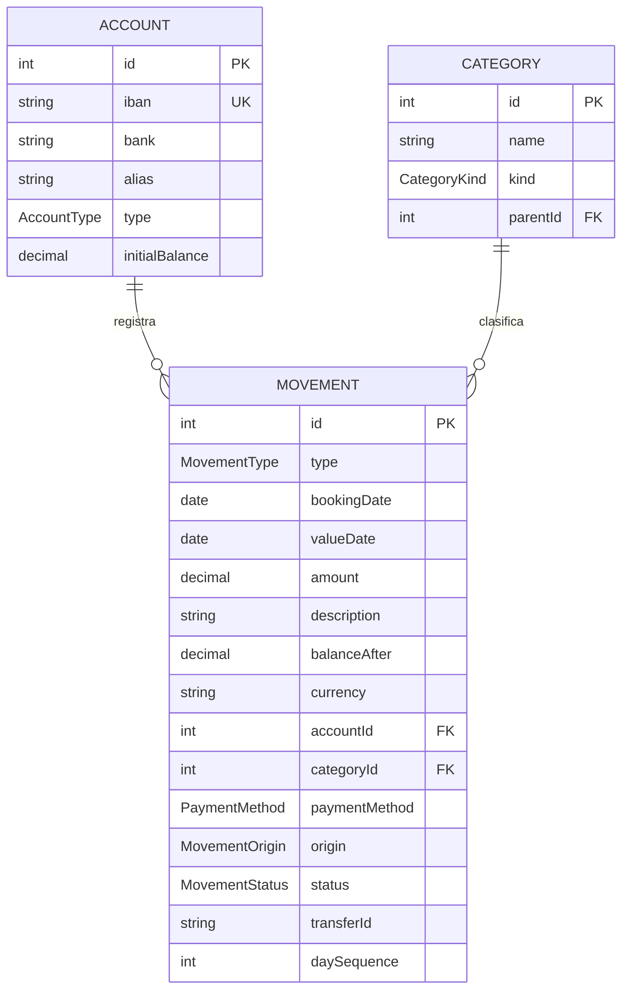
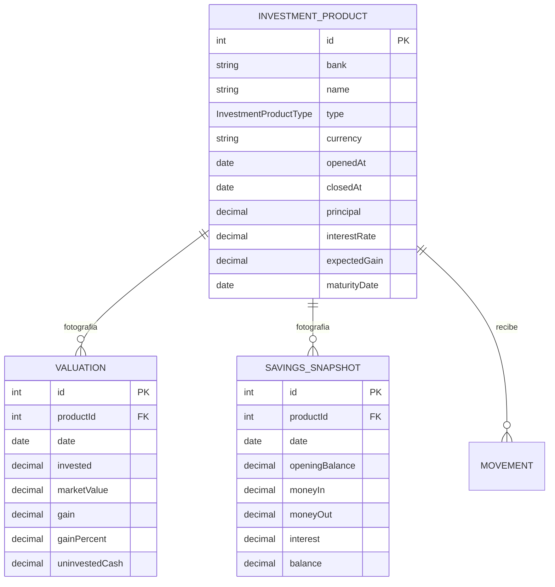

# Modelo de datos

> **Estado: IMPLEMENTADO.** Este documento describe el modelo **real** que hay en
> `prisma/schema.prisma` y en la base de datos; ya no es un borrador. Tiene dos
> partes, y la segunda se añadió **encima** de la primera sin tocarla:
>
> | Parte | Qué cubre | Feature | Decisiones |
> | --- | --- | --- | --- |
> | [Parte 1 — Flujo](#parte-1--flujo) | cuentas, movimientos, categorías | 8 `data-model` (2026-08-06) | [ADR-011](architecture.md), [`specs/data-model/`](../specs/data-model/design.md) |
> | [Parte 2 — Inversiones](#parte-2--inversiones) | productos de inversión y su valoración periódica | 9 `investments-data-model` (2026-08-11) | [ADR-012](architecture.md), [`specs/investments-data-model/`](../specs/investments-data-model/design.md) |
> | ↳ **la cuenta remunerada** | quinto tipo de producto y su **foto mensual propia** (`SavingsSnapshot`) | 26 `savings-account-as-product` (2026-08-20) | [ADR-026](architecture.md), [`specs/savings-account-as-product/`](../specs/savings-account-as-product/design.md) |
>
> Las decisiones de producto están en `../../docs/ideas.md` §2 (flujo) y §3
> (patrimonio e inversiones).
>
> ⚠️ **Breaking change:** la Parte 1 **reemplazó** al `Expense` + `Category`
> placeholder del bootstrap, cuyas tablas y endpoints `/api/expenses`
> desaparecieron en la feature 8 (ver `docs/api-contract.md`).

## Las cinco reglas que explican el modelo

> Las tres primeras son del flujo (Parte 1); la **4** y la **5** llegaron con las
> inversiones (Parte 2) y **extienden** a las reglas 2 y 3 con el mismo
> razonamiento: el número lo da la fuente, y el apunte que ya existe no se
> duplica, se enlaza.

1. **Los movimientos solo entran por importación.** No hay alta ni borrado manual
   por API (`/api/movements` es de **solo lectura**). Si un movimiento existe,
   existe en el banco y llegará en su fichero; y si no viene del banco, no debe
   tocar el saldo. El efectivo se agota en la **retirada de cajero**, que ya es
   una línea del extracto: no hace falta saber en qué se gastó ese dinero.
2. **El saldo se lee del extracto, no se suma.** Todo banco imprime el saldo tras
   cada línea, así que el saldo de una cuenta **es el del banco** (ver
   [Cálculo del saldo](#cálculo-del-saldo-de-una-cuenta)).
3. **Un traspaso entre cuentas propias no se crea: se reconoce.** Sus dos apuntes
   ya llegan en los extractos; lo único propio es el `transferId` que los enlaza
   (ver [Traspasos](#traspasos-entre-cuentas-propias)).
4. **La valoración se lee, no se calcula.** `invested`, `marketValue`, `gain`,
   `gainPercent` y `uninvestedCash` se guardan **tal como vienen en el fichero**.
   Desde la F26 la regla cubre igual los **cinco importes** de `SavingsSnapshot`
   (`openingBalance`, `moneyIn`, `moneyOut`, `interest`, `balance`): tampoco se
   derivan, ni siquiera el saldo final, que el banco puede haber redondeado.
   La app **nunca** persiste `gain = marketValue − invested`: si un día el número
   guardado y la resta no cuadran, **manda el guardado**, porque es el que da el
   banco. Campo que el fichero no traiga → `NULL`, **nunca** un valor calculado.
   (Derivar al leer para pintar una pantalla, sí; **persistir lo derivado, no**.)
5. **Una aportación no se crea: se marca.** La aportación mensual a un fondo **ya
   es un movimiento del extracto** de la cuenta corriente. La app no fabrica un
   segundo apunte: lo único propio es `Movement.productId`. Consecuencia de
   agregación, gemela de la del traspaso: **un movimiento con `productId != null`
   no cuenta como gasto ni como ingreso en los totales globales** — no has gastado
   ese dinero, lo has cambiado de sitio. Un reembolso es lo mismo con el signo
   cambiado (`income` + `productId`), **sin columna nueva**.

> ⏳ **Estado de la regla 5:** en la feature 9 está **documentada, no
> implementada**. La columna existe pero nadie la escribe, así que `computeTotals`
> todavía no la excluye; esa línea llega junto al escritor de `productId`. Efecto
> práctico hoy: **cero**, porque `productId` es siempre `null`.

## Parte 1 — Flujo

### Diagrama de entidades



> **Dos relaciones que el diagrama no dibuja como línea** (para no romper el
> render de Mermaid):
>
> - **Subcategoría:** `Category.parentId` es una **autorreferencia** — una
>   categoría puede colgar de otra (**un solo nivel** de subcategoría).
> - **Traspaso:** no es una FK. Son **dos filas `MOVEMENT` ordinarias** (un
>   `expense` en la cuenta origen y un `income` en la destino, tal como los
>   reportó cada banco) que comparten el mismo `transferId`. Es un enlace lógico.

### Esquema Prisma (el real; fuente de verdad: `prisma/schema.prisma`)

```prisma
// ── Enums ────────────────────────────────────────────────
enum AccountType {
  checking      // cuenta corriente
  savings       // cuenta de ahorro
}                // NO hay `cash`: no existe cuenta de efectivo

enum MovementType {
  expense       // gasto (lo que reportó el banco)
  income        // ingreso (lo que reportó el banco)
  neutral       // importe 0: ni ingreso ni gasto
}                // NO hay `transfer`, y NO existe el enum MovementDirection

enum CategoryKind {
  expense
  income
}

enum PaymentMethod {
  card           // tarjeta
  cash           // metálico
  bank_transfer  // transferencia
  direct_debit   // domiciliación
}

enum MovementOrigin {
  imported       // importado por la ingesta (idea #1)
  manual         // sin productor hoy; mantiene PARCIAL el índice de dedup
}

enum MovementStatus {
  confirmed
  pending_review // importado, pendiente de revisar antes de confirmar
}

// ── Modelos ──────────────────────────────────────────────
model Account {
  id             Int         @id @default(autoincrement())
  iban           String      @unique   // clave natural (normalizada Y validada en src/lib/iban.ts:
                                       // mayúsculas, sin espacios, mod-97 — ADR-021, F21)
  bank           String                // p. ej. "bankinter"
  alias          String                // por defecto "<bank> ···<4 últimos del IBAN>"
  type           AccountType @default(checking)
  initialBalance Decimal     @default(0) @db.Decimal(10, 2)  // semilla del caso excepcional
  movements      Movement[]
  createdAt      DateTime    @default(now())
  updatedAt      DateTime    @updatedAt
}

model Category {
  id        Int          @id @default(autoincrement())
  name      String
  kind      CategoryKind
  parent    Category?    @relation("Subcategories", fields: [parentId], references: [id])
  parentId  Int?
  children  Category[]   @relation("Subcategories")
  movements Movement[]
  createdAt DateTime     @default(now())

  @@unique([parentId, kind, name]) // re-creado NULLS NOT DISTINCT en la migración
}

model Movement {
  id           Int      @id @default(autoincrement())
  type         MovementType
  bookingDate  DateTime @db.Date   // fecha contable (date-only, alineada con el parser)
  valueDate    DateTime @db.Date   // fecha valor
  amount       Decimal  @db.Decimal(10, 2)  // SIEMPRE positivo; el signo lo da `type`
  description  String
  balanceAfter Decimal? @db.Decimal(10, 2)  // saldo tras el movimiento, según el extracto
  currency     String   @default("EUR")
  note         String?

  account       Account        @relation(fields: [accountId], references: [id])
  accountId     Int
  category      Category?      @relation(fields: [categoryId], references: [id])
  categoryId    Int?
  paymentMethod PaymentMethod?

  origin MovementOrigin @default(imported)        // todo viene del banco
  status MovementStatus @default(pending_review)  // y nace pendiente de revisar

  transferId  String?   // enlace lógico entre las dos piernas de un traspaso
  daySequence Int?      // posición dentro de su bookingDate (1 = el primero del día)

  createdAt DateTime @default(now())
  updatedAt DateTime @updatedAt

  @@index([accountId, bookingDate, daySequence])
  @@index([transferId])
  // Dedup de importados: índice único PARCIAL creado con SQL crudo en la migración.
}
```

#### Columnas reservadas (definidas, sin escritor todavía)

| Columna | Quién la rellenará |
| --- | --- |
| `transferId` | la feature de **detección de traspasos**, posterior a la importación |
| `categoryId` | la feature de **categorización por reglas** sobre el `description` |
| `paymentMethod` | la misma feature de reglas (`RECIBO` → `direct_debit`, `PAGO TARJETA` → `card`…) |
| `note` | anotación manual sobre un movimiento, cuando exista pantalla |
| `status` | lo escribe el **importer** (F12): nace `pending_review` y lo pasará a `confirmed` la revisión |
| `balanceAfter`, `origin` | el **importer** (F12) |
| `daySequence` | 🔄 **lo emite el parser de cada banco**, ya normalizado (F11); el importer solo lo copia |
| `Movement.productId` | la feature de **enlace de aportaciones**, sobre el parser del fichero de inversiones (regla 5; el `model Movement` real lo lleva desde la F9, ver [Parte 2](#parte-2--inversiones)) |
| ~~`InvestmentProduct.closedAt`~~ | 🔄 **ya la escribe** `persistSavingsSnapshot` (F26): sale del campo `closedAt` del fichero, tal cual, `null` incluido. Sigue siendo un acto explícito del humano, escrito una sola vez |
| ~~`InvestmentProduct.openedAt`~~ | 🔄 **ya la escribe** `persistSavingsSnapshot` (F26): sale del campo `openedAt` del fichero, **obligatorio desde la F15** (un archivo sin él es un archivo fallido, nunca un producto con la fecha en blanco). **Cero migración**: la columna ya existía desde la F9 |

> Las **tres últimas filas** las añadió la feature 9 y se explican en la
> [Parte 2](#parte-2--inversiones): `Movement.productId` es una columna del flujo,
> pero quien la escribirá y su regla (la 5) viven allí; las dos de
> `InvestmentProduct` son de esa parte entera. Viven aquí porque esta tabla es el
> registro único de columnas sin escritor del proyecto.

> 🔄 **Cambio del 2026-08-20 (F26).** `InvestmentProduct.openedAt` y
> `InvestmentProduct.closedAt` **dejan de ser columnas sin escritor**: las dos las
> escribe `persistSavingsSnapshot`
> ([`src/modules/investments/investments.service.ts`](../src/modules/investments/investments.service.ts)),
> el importador de ficheros de producto que la F26 estrenó con la cuenta remunerada
> de Trade Republic. Se quedan tachadas, y no borradas, para que se vea **de dónde
> venían**: `openedAt` nació en la F9 sin escritor, la F15 le dio el campo en el
> fichero y la F26 le ha dado por fin quien lo guarde. **Ninguna de las dos se
> infiere**: si el fichero no trae `openedAt`, el fichero se rechaza entero; y una
> ausencia nunca cierra un producto (ver
> [Reglas de negocio de inversiones](#reglas-de-negocio-de-inversiones-las-vigila-el-servicio-no-la-bd)).
> `Movement.productId` **sigue sin escritor**: es la única fila de inversiones que
> queda en esta tabla.

> 🔄 **Cambio del 2026-08-13 (F15).** `InvestmentProduct.openedAt` **ya tiene de dónde
> salir** (quien la guarda llegó después, con la F26: ver la nota de arriba). Nació en
> la F9 sin escritor porque el formato del fichero de producto no llevaba el campo, y esta tabla la daba por condenada a `NULL`. La F15 lo añadió al
> fichero y lo hizo **obligatorio en los cuatro tipos** (`fund`, `etf`,
> `managed_portfolio`, `deposit`), decidido así por el humano frente a admitirlo vacío.
> El formato está en [`myinvestor-product-files.md`](myinvestor-product-files.md).

> 🔄 **Cambio del 2026-08-11.** El design de la f8 dejó el cálculo de
> `daySequence` en el importer, pero avisó: «cuando haya un segundo banco,
> conviene que cada parser emita la posición ya normalizada»
> (`specs/data-model/design.md:584`). Ese segundo banco llegó, así que se mueve.
> El sentido de la exportación —Bankinter va de más reciente a más antiguo— es
> conocimiento del banco; si lo resolviera el importer, el importer sería
> bank-specific y no podría compartirse entre los ~7 bancos.

### Reglas de negocio (las vigila el servicio, no la BD)

- **`amount` siempre positivo.** El efecto sobre el saldo lo determina el `type`,
  no el signo del número. El importe 0 es `neutral` y aporta 0
  (`deriveMovementTypeFromAmount`: `<0 → expense`, `>0 → income`, `=0 → neutral`).
- **`type` es inmutable.** Es lo que reportó el banco y forma parte de la clave
  del índice de dedup: mutarlo (p. ej. para marcar un traspaso) haría que una
  reimportación del mismo extracto ya no colisionara → duplicado silencioso.
- **Categorías:** un solo nivel (el padre de una subcategoría debe ser raíz) y el
  `kind` de la hija debe coincidir con el del padre. El catálogo lo crea el
  usuario (`POST /api/categories`); asignarlo a los movimientos será automático
  por reglas, en una feature posterior.
- **Origen / estado:** lo importado entra como `imported` / `pending_review` y
  alimenta la pantalla de revisión (idea #1).

#### Cálculo del saldo de una cuenta

El saldo **no se recalcula sumando**: se **lee** del extracto.

```
balance(cuenta):
  M = movimiento de la cuenta con balanceAfter != null más reciente
      ORDER BY bookingDate DESC, daySequence DESC   LIMIT 1
  si M existe:  balance = M.balanceAfter                          # el número del banco, tal cual
  si no:        balance = initialBalance + Σ income − Σ expense   # CASO EXCEPCIONAL
                (neutral aporta 0)
```

La rama de la suma es solo el plan B: un banco cuyo extracto **no traiga saldo
corrido**, o una cuenta a la que todavía no se le ha importado nada. El
`initialBalance` de `Account` es la semilla de esa rama.

Ninguna rama mira `transferId`: la pierna de un traspaso es un cargo (o un abono)
real de esa cuenta y ya está dentro del `balanceAfter` que dio el banco.

**Totales globales:** un movimiento con `transferId != null` **no** cuenta como
gasto ni como ingreso, y un `neutral` tampoco. Como el par de un traspaso se
compone de un cargo y un abono del mismo importe, excluirlo entero deja el total
global igual que antes del traspaso.

#### Traspasos entre cuentas propias

Un traspaso **no se crea desde la app y no tiene endpoint**: el banco de origen ya
lo reporta como un cargo (`expense`) y el de destino como un abono (`income`).
Fabricarlos por API los duplicaría (4 filas por traspaso). El modelo solo aporta:

- **`transferId` compartido** por las dos piernas — enlace lógico, indexado.
- **La regla de agregación:** no cuentan como gasto ni como ingreso en los
  totales globales.

Quién rellena `transferId` es una **feature posterior** a la importación
(detección automática: mismo importe, signo opuesto, fechas próximas, dos cuentas
propias distintas; sin marcado manual). Hasta entonces la columna está vacía y un
traspaso interno cuenta en los totales — asumido, porque todavía no hay
dashboards que los consuman.

> **Por qué hace falta emparejar y no basta con leer el concepto:** el banco pone
> "TRANSFERENCIA" tanto cuando te pagas a ti mismo como cuando pagas a un tercero,
> y la segunda **sí** es un gasto real. Lo que distingue al traspaso interno es que
> la contrapartida sea **otra cuenta tuya**, y eso solo se ve mirando los dos
> extractos a la vez.

#### `daySequence`: el orden dentro del día

`Movement.daySequence` guarda la **posición del movimiento dentro de su
`bookingDate`** (`1` = el primero de ese día en orden cronológico). Fija el orden
intradía, que ni `bookingDate` ni el `id` autoincremental garantizan, y participa
en la clave del índice de dedup.

Se guarda la posición **dentro del día** y no el número de línea del fichero
porque ese número **no es estable entre descargas** (el mismo movimiento cae en
una línea distinta según el rango descargado), mientras que su posición dentro del
día sí lo es.

> **Contrato con el importer:** Bankinter exporta **de más reciente a más
> antiguo**, así que el importer recorre las filas de cada día **de abajo arriba**
> y numera `1, 2, 3…`. Conviene descargar por **días completos**: un día partido
> entre dos descargas reempezaría en 1 y produciría un duplicado (visible y
> corregible, no una pérdida silenciosa).

### Índices personalizados (SQL crudo en la migración)

Prisma 7 no expresa ninguno de los dos en el schema (el `@@index(where:, unique:)`
declarativo es de Prisma 8), así que se crean con SQL dentro del archivo de
migración `prisma/migrations/*_data_model/migration.sql`.

**1. Dedup de movimientos importados** — cierra el punto abierto nº 1 del
borrador anterior. Se **descartó** la columna `importHash` (abría la
sub-decisión de la receta del hash y la normalización del concepto); el índice
compuesto da la misma garantía con la clave **visible y auditable**:

```sql
CREATE UNIQUE INDEX "Movement_imported_dedup_key"
  ON "Movement" ("accountId", "bookingDate", "type", "amount", "description", "daySequence")
  WHERE "origin" = 'imported';
```

- `type` entra en la clave porque, con la convención "importe siempre positivo",
  una salida y una entrada del mismo día, importe y concepto son movimientos
  distintos.
- 🔴 **`daySequence` entra en la clave para no perder dinero.** Un extracto real
  trae líneas **idénticas legítimas**: en la muestra del humano hay **tres**
  `TRANS INM/ OTRO BANCO −850,00` el `2026-07-24`. Sin `daySequence` la clave las
  trataría como el mismo movimiento y la importación guardaría **una**,
  descartando dos en silencio (−2.000 €).
- Los movimientos `manual` quedan **fuera** del predicado: no se les impone
  unicidad.

**2. Unicidad de categoría raíz** — cierra el punto abierto nº 2 del borrador
anterior. En Postgres los `NULL` son distintos entre sí, así que el
`@@unique([parentId, kind, name])` no impide dos raíces homónimas. Se resuelve con
**`NULLS NOT DISTINCT`** (Postgres 15+; el proyecto corre Postgres 17), mismo
nombre y mismas columnas que el índice que Prisma espera:

```sql
DROP INDEX "Category_parentId_kind_name_key";
CREATE UNIQUE INDEX "Category_parentId_kind_name_key"
  ON "Category" ("parentId", "kind", "name") NULLS NOT DISTINCT;
```

Alternativas descartadas: dos índices parciales (dos objetos donde basta uno) y un
centinela `parentId = 0` (ensucia el modelo y complica los `include`).

### Puntos abiertos

> Los puntos 1 y 2 del borrador (dedup y unicidad de raíz) quedaron **cerrados**
> por la feature 8; ver la sección anterior.

1. **¿Los `pending_review` cuentan en saldos/dashboards** o se excluyen hasta
   confirmarlos? (afecta a las consultas, no al esquema).
2. ✅ **Precisión `Decimal(10, 2)`:** heredada del bootstrap (máx. ~100 M).
   **Confirmada por el humano el 2026-08-11** en la puerta de la feature 9: se
   queda, y las inversiones (Parte 2) **heredan el mismo techo**. Si algún día se
   sube, hay que subirlo **en las dos capas a la vez**.
3. **`AccountType`:** hoy `checking` / `savings`. Añadir `credit` (tarjeta de
   crédito como cuenta) se puede hacer luego sin migración de datos.

## Parte 2 — Inversiones

> **Estado: IMPLEMENTADO** por la feature 9 `investments-data-model`
> (2026-08-11): **esquema y migración**, exactamente el mismo alcance que la
> feature 8 tuvo con el flujo. Decisiones en [ADR-012](architecture.md) y en
> [`specs/investments-data-model/`](../specs/investments-data-model/design.md).
>
> 🔄 **Ampliada por la feature 26 `savings-account-as-product`** (2026-08-20,
> [ADR-026](architecture.md)): entra el **quinto tipo de producto**,
> `savings_account`, con **serie propia** (`SavingsSnapshot`) en vez de `Valuation`,
> y esta parte **estrena escritor**: `persistSavingsSnapshot` guarda el producto y la
> foto del mes desde `POST /api/import`. **Sigue sin consultas:** ninguna ruta LEE
> todavía estas tablas. También **aditiva**: no se modificó ni un campo, índice o
> enum anterior.
>
> **Lo que sigue vale para los cinco tipos salvo donde se diga.** Los ficheros de
> producto de **MyInvestor siguen sin llegar a la base**: la F26 entró solo con Trade
> Republic y su feature hermana está pendiente.
>
> **Todo es aditivo:** la única línea que toca el núcleo del flujo es
> `Movement.productId`. Ningún campo, índice o enum de la Parte 1 se modificó.
>
> 📄 **Premisa que explica casi todo:** los productos de inversión **no** vienen
> de un export del banco, sino de un **fichero de texto escrito a mano** por el
> dueño. El fichero se hace **a medida del modelo, no al revés**: no hay que
> defenderse de lo que un banco decida imprimir. De ahí que la clave natural sea
> el nombre y que no existan `isin`, `alias`, participaciones ni valor
> liquidativo.

### Diagrama de entidades



> Las cuatro columnas grises del producto (`principal`, `interestRate`,
> `expectedGain`, `maturityDate`) son **solo del depósito** y quedan `NULL` en los
> otros **cuatro** tipos. La relación `INVESTMENT_PRODUCT ||--o{ MOVEMENT` es la
> columna reservada `Movement.productId` (regla 5).

> **Dos tablas de foto, no una** (F26): un producto tiene serie de `VALUATION` **o**
> serie de `SAVINGS_SNAPSHOT`, nunca las dos. Cuál le toca lo dice su `type`, y lo
> vigila el servicio (ver
> [Reglas de negocio](#reglas-de-negocio-de-inversiones-las-vigila-el-servicio-no-la-bd)).
> El `deposit` no tiene ninguna de las dos.

### Esquema Prisma (el real; fuente de verdad: `prisma/schema.prisma`)

```prisma
// ── Enum ─────────────────────────────────────────────────
enum InvestmentProductType {
  fund               // fondo de inversión
  etf                // ETF
  // El nombre del tipo es el que usa el banco, no un dato del humano: colisiona con
  // var/ solo porque él llama al suyo igual. Por eso las dos líneas van marcadas.
  managed_portfolio  // cartera automatizada: UN producto con su valor total  // no-real-data-ok
  deposit            // depósito a plazo: el único con parte específica  // no-real-data-ok
  savings_account    // cuenta remunerada (F26): no fluctúa, crece con los intereses
}

// ── Modelos ──────────────────────────────────────────────
model InvestmentProduct {
  id       Int                   @id @default(autoincrement())
  bank     String                // slug de la carpeta de Drive, igual que Account.bank
  name     String                // lo escribe el humano en el fichero → es estable
  type     InvestmentProductType
  currency String                @default("EUR")

  openedAt DateTime? @db.Date    // contratación / primera aportación
  closedAt DateTime? @db.Date    // NULL = vivo. Sin enum `status`

  // Parte específica del depósito (NULL en fund / etf / managed_portfolio)
  principal    Decimal?  @db.Decimal(10, 2)  // capital contratado
  interestRate Decimal?  @db.Decimal(6, 4)   // 🔴 TAE EN PORCENTAJE: 2.7500 = 2,75 %
  expectedGain Decimal?  @db.Decimal(10, 2)  // ganancia final, conocida desde el día uno
  maturityDate DateTime? @db.Date            // vencimiento

  valuations       Valuation[]        // serie de fund / etf / managed_portfolio
  savingsSnapshots SavingsSnapshot[]  // serie de savings_account (F26)
  movements        Movement[]

  createdAt DateTime @default(now())
  updatedAt DateTime @updatedAt

  @@unique([bank, name])   // clave natural
}

model Valuation {
  id        Int               @id @default(autoincrement())
  product   InvestmentProduct @relation(fields: [productId], references: [id])
  productId Int
  date      DateTime          @db.Date

  invested       Decimal  @db.Decimal(10, 2)  // CRECE con las aportaciones mensuales
  marketValue    Decimal  @db.Decimal(10, 2)  // lo que vale hoy si lo vendes
  gain           Decimal? @db.Decimal(10, 2)  // CON SIGNO: una pérdida es negativa
  gainPercent    Decimal? @db.Decimal(7, 4)   // CON SIGNO: -3.4700 = −3,47 %
  uninvestedCash Decimal? @db.Decimal(10, 2)  // efectivo sin invertir, APARTE del marketValue

  createdAt DateTime @default(now())
  updatedAt DateTime @updatedAt   // recargar el mismo fichero es UPSERT: gana el último

  @@unique([productId, date])     // una foto por producto y fecha
}

// La foto mensual de una CUENTA REMUNERADA (F26). Gemela de `Valuation` en oficio
// —una fila por producto y fecha, recargar es UPSERT, nada se calcula— y distinta
// en contenido: aquí no hay valor de mercado ni ganancia acumulada, hay un saldo
// que se mueve con lo que entra, lo que sale y los intereses.
model SavingsSnapshot {
  id        Int               @id @default(autoincrement())
  product   InvestmentProduct @relation(fields: [productId], references: [id])
  productId Int
  date      DateTime          @db.Date   // el día del abono de intereses

  openingBalance Decimal @db.Decimal(10, 2)  // saldo con el que empezó el mes
  moneyIn        Decimal @db.Decimal(10, 2)  // lo que entró, SIN los intereses
  moneyOut       Decimal @db.Decimal(10, 2)  // lo que salió
  interest       Decimal @db.Decimal(10, 2)  // los intereses abonados ese día
  balance        Decimal @db.Decimal(10, 2)  // saldo final, justo tras el abono

  createdAt DateTime @default(now())
  updatedAt DateTime @updatedAt

  @@unique([productId, date])     // una foto por producto y fecha
}
```

> 🔴 **Los cinco importes son NOT NULL**, a diferencia de `gain`, `gainPercent` y
> `uninvestedCash` de `Valuation`, que sí admiten `NULL`. No es una asimetría
> gratuita: el parser **exige los cinco** y además comprueba que cuadren, así que un
> fichero al que le falte uno **no llega** a esta tabla y no hay ningún camino que
> pueda dejar un hueco.
>
> **`moneyIn` NO incluye los intereses** —van aparte, en `interest`—, y esa es la
> única resta que hace el humano al copiar el resumen de su extracto. La comprobación
> que el parser hace **antes** de escribir, en céntimos enteros y con un céntimo de
> margen para el redondeo del propio banco, es:
>
> ```
> openingBalance + moneyIn − moneyOut + interest = balance
> ```
>
> Es una **verificación, no un cálculo** (regla 4): si cuadra, los cinco números se
> guardan tal como están escritos; si no cuadra **no se guarda nada** —ni el producto
> ni la foto— y el fichero se rechaza entero. El formato del fichero está en
> [`trade-republic-product-files.md`](trade-republic-product-files.md).

Y lo único que esta parte añadió al `model Movement` de la Parte 1, junto a
`transferId`:

```prisma
  product   InvestmentProduct? @relation(fields: [productId], references: [id])
  productId Int?    // RESERVADA (regla 5). ⚠️ NO sirve para derivar `invested`

  @@index([productId])   // gemelo de @@index([transferId])
```

> ⚠️ **`Movement.productId` NO sirve para derivar `invested`.** La tentación es
> obvia: "si tengo los movimientos enlazados, puedo sumar las aportaciones y sacar
> el capital invertido". **No.** El `invested` de una foto es el número que da el
> banco (regla 4); la suma de los movimientos enlazados es otra cosa (le faltan
> las aportaciones anteriores a la primera importación, los traspasos internos del
> banco de inversión, las comisiones…). El enlace sirve para **no contar la
> aportación como gasto** (regla 5) y para navegar del movimiento a su producto.

### Una sola tabla de producto, con la parte del depósito dentro

`fund`, `etf` y `managed_portfolio` llevan **exactamente los mismos campos**: son
tres valores del enum, no tres tablas. La cartera automatizada es **un** producto
con su valor total, **sin desglose** de los fondos que lleva dentro. El único
distinto es el **depósito**, y su parte específica son **cuatro columnas nullable
de la misma tabla**.

**La cuenta remunerada (F26) tampoco añadió ninguna columna al producto:** es un
quinto valor del enum con **los mismos campos comunes** y las cuatro del depósito en
`NULL`. Lo propio suyo es **su serie**, `SavingsSnapshot`, porque `Valuation` habla de
«lo invertido» y «lo que vale hoy» y esta cuenta no invierte: crece con los intereses.
Encajar sus cinco importes en `Valuation` habría perdido **tres de los cinco**
(`openingBalance`, `moneyIn`, `moneyOut`) y con ellos la posibilidad de volver a
comprobar el cuadre desde la base; y peor, cualquier consulta futura de patrimonio
sumaría su `invested` como capital invertido, que es **falso**. Reutilizar `deposit`
tampoco valía: un depósito tiene vencimiento e interés pactado de antemano, y una
cuenta remunerada no tiene ni lo uno ni lo otro. El razonamiento entero, con las
cuatro alternativas descartadas, está en [ADR-026](architecture.md).

| Tipo | Parte del depósito | Su serie de fotos |
| --- | --- | --- |
| `fund` · `etf` · `managed_portfolio` | `NULL` | `Valuation` |
| `deposit` | las cuatro columnas | **ninguna** (no fluctúa) |
| `savings_account` | `NULL` | `SavingsSnapshot` |

**Por qué `invested` está en la foto y `principal` en el producto** — es la
consecuencia directa de las aportaciones mensuales: el capital invertido de un
fondo **no es un dato del producto, es un dato de la fecha** (en marzo 12.000 €,
en abril 12.300 €). Guardarlo en `InvestmentProduct` obligaría a **pisarlo cada
mes** y perdería la serie, que es justo lo que permite distinguir *"ha subido
porque metí dinero"* de *"ha subido porque el mercado subió"*. El depósito es el
caso contrario: se contrata una vez, con sus condiciones cerradas, y no fluctúa.

🔴 **`interestRate` es la TAE en PORCENTAJE, no una fracción.** `2.7500` significa
**2,75 %**, no 275 % ni 0,0275. Es el error clásico de este campo y el modelo no
puede detectarlo solo. De un depósito se guarda **una sola** TAE y **un solo**
`expectedGain`: los **aplicados**. Si el banco publica una segunda TAE hipotética
(p. ej. "sin Premium"), **no se guarda** en ninguna parte: es información
comercial, no una condición del producto contratado.

### Claves naturales

| Tabla | Clave | Por qué basta |
| --- | --- | --- |
| `InvestmentProduct` | `@@unique([bank, name])` | El `name` lo escribe el humano en un fichero hecho a mano, luego es **estable por construcción**: no hay un banco que lo renombre a mitad de año. Por eso caen el `isin` y la segunda clave `(bank, name, maturityDate)` para depósitos: dos depósitos los distingues tú al nombrarlos. El `bank` entra para no bloquear un futuro segundo banco con un producto homónimo. |
| `Valuation` | `@@unique([productId, date])` | Una foto por producto y fecha. Es también el índice que sirve la consulta de patrimonio ("la valoración más reciente con `date <= D`") sin ningún índice adicional. |
| `SavingsSnapshot` | `@@unique([productId, date])` | Lo mismo y por lo mismo: una foto por producto y fecha, con la `date` que **escribe el humano** (el día del abono de intereses). **De esta clave cuelga toda la idempotencia de la F26**, y aguanta porque ni ella ni `(bank, name)` llevan un contador, una posición o un autoincremento que alguien pueda **renumerar** — que es justo lo que le pasó a `Movement.daySequence` en el flujo. |

- **Consecuencia que hay que conocer:** si un día **renombras** un producto en el
  fichero, el importador lo verá como un producto **nuevo** y la serie anterior
  quedará colgando del nombre viejo. Es el precio de usar el nombre como clave; a
  cambio, el fichero no necesita ningún identificador técnico que copiar a mano.
- **Cero SQL crudo:** los **cuatro** índices de esta parte (`@@unique([bank, name])`,
  los **dos** `@@unique([productId, date])` —el de `Valuation` y el de
  `SavingsSnapshot`, F26— y `@@index([productId])`) son **declarativos**, así que
  Prisma los conoce y no puede haber drift — a diferencia de los dos índices a mano de
  la Parte 1, que Prisma 7 no sabe expresar.

### Recargar el mismo fichero: UPSERT, gana el último

Volver a cargar el fichero **no duplica nada**: la foto de un producto en una
fecha es única y se queda con el último dato cargado.

```
upsert(where: { productId_date: { productId, date } },
       create: {...}, update: {...})     // gana el último; updatedAt avanza
```

🔴 **Es una resolución de conflicto DISTINTA a la del flujo**, y conviene tenerlo
delante para que nadie invente una tercera:

| Colisión | Flujo (Parte 1) | Inversiones (Parte 2) |
| --- | --- | --- |
| Clave | `(accountId, bookingDate, type, amount, description, daySequence)` `WHERE origin='imported'` | `(productId, date)` |
| Qué pasa | El duplicado se **descarta**: el movimiento ya importado es **el mismo hecho** | El duplicado **sobrescribe**: la foto es una **medición** que puede corregirse |
| Por qué | Un movimiento es un hecho pasado inmutable | Una valoración es un dato observado que puede refinarse (el banco publica el valor definitivo un día después) |

📌 **El importador necesita DOS upserts, no uno.** Cada fichero mensual
**re-afirma** la identidad y las condiciones de **todos** los productos (el humano
copia el del mes pasado y cambia los números), así que el depósito vuelve a venir
entero mes tras mes. Un `create` del producto reventaría con `P2002` en el segundo
fichero: hay que hacer **UPSERT también del producto**, sobre `(bank, name)`.

✅ **Ya no es futuro (F26).** `persistSavingsSnapshot`
([`src/modules/investments/investments.service.ts`](../src/modules/investments/investments.service.ts))
hace exactamente esos dos upserts —producto sobre `(bank, name)`, foto sobre
`(productId, date)`— **dentro de una sola transacción**, y es el **único** escritor de
estas tablas en todo `src/` (lo vigila un guardián de `src/architecture.test.ts`). Los
dos van juntos o no va ninguno: no puede quedar un producto sin su foto. Hoy escribe
`SavingsSnapshot`; la feature hermana de MyInvestor reutilizará la misma vía cambiando
la segunda tabla por `Valuation`.

### Reglas de negocio de inversiones (las vigila el servicio, no la BD)

- 🔴 **Un depósito no tiene valoraciones.** Sus condiciones se escriben una vez al
  contratarlo y no fluctúan, así que no necesita foto periódica. Es una **regla
  del servicio**, igual que las demás reglas de negocio del proyecto, y **la base
  de datos no la impide**: hoy nada bloquea insertar una `Valuation` sobre un
  producto `deposit` (límite conocido, con test que lo deja escrito). Se decidió
  así por tres razones: coherencia con el resto del modelo (la BD impone
  **identidad y unicidad**, el servicio impone **coherencia de dominio**); mantiene
  el **cero SQL crudo**; y, sobre todo, un `CHECK` **no puede consultar otra
  tabla** — impedirlo en la BD exigiría un trigger o desnormalizar el `type` en
  `Valuation`.
- 🔴 **Cada producto tiene UNA serie, la que le toca por su tipo** (F26). Un
  `savings_account` no tiene `Valuation`, y un `fund`, `etf`, `managed_portfolio` o
  `deposit` no tiene `SavingsSnapshot`. Es la **regla gemela** de la anterior, se
  vigila igual —en el **servicio**, no en la BD— y por las mismas tres razones. En la
  práctica el servicio va un paso más allá que con el depósito: si llega un fichero de
  cuenta remunerada cuyo `name` **ya existe** en ese banco con otro tipo, el fichero se
  **rechaza** en vez de convertirle el tipo al producto en silencio.
- 🔴 **Dejar de escribir un producto NO lo cierra.** El cierre es explícito: el
  `closedAt` que el humano escribe **una sola vez** en el fichero, en la última
  aparición del producto (el mes en que vence o se reembolsa). Un mes con prisa en
  el que te dejas un fondo cerraría un producto vivo y hundiría el patrimonio sin
  motivo: convertir una **ausencia** (que puede ser un olvido) en un **hecho** (el
  producto se acabó) es exactamente la inferencia que no debe hacer un sistema con
  dinero dentro. El importador **no infiere nada de las ausencias**; como mucho,
  avisa.
- **Ciclo de vida solo con `closedAt`** (`NULL` = vivo). No hay enum `status` ni
  booleano `isClosed`: serían un dato derivable duplicado que acaba
  desincronizado, y el booleano además perdería **cuándo** se cerró, que es lo que
  la consulta de patrimonio necesita para excluir un depósito vencido a una fecha
  pasada.
- **Sin `origin` ni `status` en `Valuation`.** Sus dos razones de ser en `Movement`
  —mantener PARCIAL el índice de dedup y alimentar la pantalla de revisión— no
  existen aquí: la unicidad de la foto es total y deseada, y una valoración no se
  revisa (es un número que el humano transcribe él mismo a su fichero).

### Patrimonio: `marketValue + uninvestedCash`

✅ **El valor de mercado NO incluye el efectivo sin invertir: van aparte.**
Confirmado por el humano con la web del banco delante —*"el efectivo queda fuera
de cualquier total, eso siempre se queda como remanente"*— y **demostrado por la
aritmética de las muestras reales**:

| Muestra | Invertido | Ganancia | Suma | Valor de mercado | Efectivo |
| --- | --- | --- | --- | --- | --- |
| cartera automatizada | 8.250,45 | 1.250,15 | **9.500,60** | **9.500,60** ✅ | 75,25 **fuera** |
| fondo | 2.000,00 | 150,00 | **2.150,00** | **2.150,00** ✅ | — |

> **Cifras inventadas** (saneado el 2026-08-12, F14). La relación que la tabla
> demuestra es la que se observó en las muestras reales de
> `var/drive-read/myinvestor/2026/` (gitignoreada); los importes del humano **no se
> versionan** — ver `docs/conventions.md` §Tests y `src/no-real-data.test.ts`.

El valor de mercado cuadra **al céntimo** con `invertido + ganancia`, sin el
efectivo. Por tanto **no hay doble conteo** y el patrimonio de un producto a una
fecha es:

```
patrimonio(producto, D) = marketValue + uninvestedCash   # de su Valuation más reciente con date <= D
```

**Patrimonio neto a una fecha `D`** (consulta de una feature posterior, aquí solo
documentada):

- **Productos que fluctúan y están vivos** (`closedAt IS NULL`): por cada uno, su
  `Valuation` más reciente con `date <= D` → `marketValue + uninvestedCash`.
- **Depósitos vivos:** su `principal` (no fluctúa; el `expectedGain` solo se
  realiza al vencimiento).
- **Cuentas remuneradas vivas (F26):** el `balance` de su `SavingsSnapshot` más
  reciente con `date <= D`. Es un saldo, no un valor de mercado, así que **no** se le
  suma nada aparte: aquí no hay `uninvestedCash` que valga. 📌 Esa consulta **no
  existe todavía** y nadie ha decidido su forma; aquí solo queda dicho de dónde
  saldría el número.
- **Cuentas:** el saldo que ya calcula `computeAccountBalance` (Parte 1).

> 📌 **Aviso sobre el saldo del banco de inversión.** Su extracto de cuenta
> corriente **no trae saldo por movimiento**, así que `Movement.balanceAfter` será
> siempre `NULL` para esa cuenta y `computeAccountBalance` caerá en la rama que
> suma desde `initialBalance` — el **caso excepcional** de la regla 2 pasa a ser el
> camino normal. El código ya lo soporta sin tocar una línea, pero
> **`Account.initialBalance` deja de ser decorativo: es el único ancla del saldo de
> esa cuenta.** Y como su extracto **tampoco trae IBAN**, esa cuenta hay que darla
> de alta **a mano** (`POST /api/accounts`); es el camino previsto por
> `MISSING_ACCOUNT_DATA` (422), no un problema.

## Lo que NO está aquí (fase siguiente)

El modelo (las dos partes) ya está en la base de datos. Lo que falta es **quién lo
escribe y quién lo lee**:

- ✅ **Parsers** — hechos: el del fichero de producto de MyInvestor (F13, F15), el
  del extracto de su cuenta corriente (F10) y el de la cuenta remunerada de Trade
  Republic (F20). Sigue sin escribirse el del **extracto en PDF** de Trade Republic, y
  es deliberado (ADR-024).
- ✅ **Importador** — hecho: el flujo desde la F12 (`Movement` y `Account`, con su
  descarte por dedup) y las inversiones desde la F26, con sus **dos upserts**
  (`InvestmentProduct` + `SavingsSnapshot`). ⏳ **Falta** que los ficheros de producto
  de **MyInvestor** entren por esa misma vía y escriban `Valuation`: es la feature
  hermana de la F26.
- **Escritor de `Movement.productId`** (enlace de aportaciones) y, con él, la
  **implementación de la regla 5** en `computeTotals`.
- **Consulta de patrimonio neto y dashboards** (idea #4), con el cálculo que ya
  queda escrito arriba. 📌 Es lo que más se nota desde la F26: ya hay productos y
  fotos **escritos** en la base y **ninguna forma de leerlos** por API.
