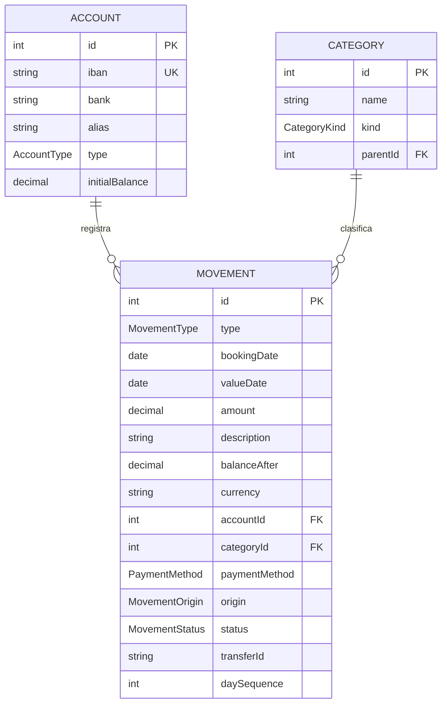

# Modelo de datos del flujo (implementado)

> **Estado: IMPLEMENTADO** por la feature 8 `data-model` (2026-08-06). Este
> documento describe el modelo **real** que hay en `prisma/schema.prisma` y en la
> base de datos; ya no es un borrador. Las decisiones que hay detrás están en
> [`docs/architecture.md` ADR-011](architecture.md) y en
> [`specs/data-model/`](../specs/data-model/design.md); las de producto, en
> `../../docs/ideas.md` §2.
>
> **Alcance:** solo el **flujo** (cuentas, movimientos, categorías). El
> **patrimonio e inversiones (idea #3)** se añade en una fase posterior **encima**
> de este núcleo, sin tocar lo anterior.
>
> ⚠️ **Breaking change:** este modelo **reemplaza** al `Expense` + `Category`
> placeholder del bootstrap, cuyas tablas y endpoints `/api/expenses`
> desaparecieron en la misma feature (ver `docs/api-contract.md`).

## Las tres reglas que explican el modelo

1. **Los movimientos solo entran por importación.** No hay alta ni borrado manual
   por API (`/api/movements` es de **solo lectura**). Si un movimiento existe,
   existe en el banco y llegará en su fichero; y si no viene del banco, no debe
   tocar el saldo. El efectivo se agota en la **retirada de cajero**, que ya es
   una línea del extracto: no hace falta saber en qué se gastó ese dinero.
2. **El saldo se lee del extracto, no se suma.** Todo banco imprime el saldo tras
   cada línea, así que el saldo de una cuenta **es el del banco** (ver
   [Cálculo del saldo](#cálculo-del-saldo-de-una-cuenta)).
3. **Un traspaso entre cuentas propias no se crea: se reconoce.** Sus dos apuntes
   ya llegan en los extractos; lo único propio es el `transferId` que los enlaza
   (ver [Traspasos](#traspasos-entre-cuentas-propias)).

## Diagrama de entidades



> **Dos relaciones que el diagrama no dibuja como línea** (para no romper el
> render de Mermaid):
>
> - **Subcategoría:** `Category.parentId` es una **autorreferencia** — una
>   categoría puede colgar de otra (**un solo nivel** de subcategoría).
> - **Traspaso:** no es una FK. Son **dos filas `MOVEMENT` ordinarias** (un
>   `expense` en la cuenta origen y un `income` en la destino, tal como los
>   reportó cada banco) que comparten el mismo `transferId`. Es un enlace lógico.

## Esquema Prisma (el real; fuente de verdad: `prisma/schema.prisma`)

```prisma
// ── Enums ────────────────────────────────────────────────
enum AccountType {
  checking      // cuenta corriente
  savings       // cuenta de ahorro
}                // NO hay `cash`: no existe cuenta de efectivo

enum MovementType {
  expense       // gasto (lo que reportó el banco)
  income        // ingreso (lo que reportó el banco)
  neutral       // importe 0: ni ingreso ni gasto
}                // NO hay `transfer`, y NO existe el enum MovementDirection

enum CategoryKind {
  expense
  income
}

enum PaymentMethod {
  card           // tarjeta
  cash           // metálico
  bank_transfer  // transferencia
  direct_debit   // domiciliación
}

enum MovementOrigin {
  imported       // importado por la ingesta (idea #1)
  manual         // sin productor hoy; mantiene PARCIAL el índice de dedup
}

enum MovementStatus {
  confirmed
  pending_review // importado, pendiente de revisar antes de confirmar
}

// ── Modelos ──────────────────────────────────────────────
model Account {
  id             Int         @id @default(autoincrement())
  iban           String      @unique   // clave natural (normalizada: mayúsculas, sin espacios)
  bank           String                // p. ej. "bankinter"
  alias          String                // por defecto "<bank> ···<4 últimos del IBAN>"
  type           AccountType @default(checking)
  initialBalance Decimal     @default(0) @db.Decimal(10, 2)  // semilla del caso excepcional
  movements      Movement[]
  createdAt      DateTime    @default(now())
  updatedAt      DateTime    @updatedAt
}

model Category {
  id        Int          @id @default(autoincrement())
  name      String
  kind      CategoryKind
  parent    Category?    @relation("Subcategories", fields: [parentId], references: [id])
  parentId  Int?
  children  Category[]   @relation("Subcategories")
  movements Movement[]
  createdAt DateTime     @default(now())

  @@unique([parentId, kind, name]) // re-creado NULLS NOT DISTINCT en la migración
}

model Movement {
  id           Int      @id @default(autoincrement())
  type         MovementType
  bookingDate  DateTime @db.Date   // fecha contable (date-only, alineada con el parser)
  valueDate    DateTime @db.Date   // fecha valor
  amount       Decimal  @db.Decimal(10, 2)  // SIEMPRE positivo; el signo lo da `type`
  description  String
  balanceAfter Decimal? @db.Decimal(10, 2)  // saldo tras el movimiento, según el extracto
  currency     String   @default("EUR")
  note         String?

  account       Account        @relation(fields: [accountId], references: [id])
  accountId     Int
  category      Category?      @relation(fields: [categoryId], references: [id])
  categoryId    Int?
  paymentMethod PaymentMethod?

  origin MovementOrigin @default(imported)        // todo viene del banco
  status MovementStatus @default(pending_review)  // y nace pendiente de revisar

  transferId  String?   // enlace lógico entre las dos piernas de un traspaso
  daySequence Int?      // posición dentro de su bookingDate (1 = el primero del día)

  createdAt DateTime @default(now())
  updatedAt DateTime @updatedAt

  @@index([accountId, bookingDate, daySequence])
  @@index([transferId])
  // Dedup de importados: índice único PARCIAL creado con SQL crudo en la migración.
}
```

### Columnas reservadas (definidas, sin escritor todavía)

| Columna | Quién la rellenará |
| --- | --- |
| `transferId` | la feature de **detección de traspasos**, posterior a la importación |
| `categoryId` | la feature de **categorización por reglas** sobre el `description` |
| `paymentMethod` | la misma feature de reglas (`RECIBO` → `direct_debit`, `PAGO TARJETA` → `card`…) |
| `note` | anotación manual sobre un movimiento, cuando exista pantalla |
| `status` | nace `pending_review`; lo pasará a `confirmed` la revisión |
| `daySequence`, `balanceAfter`, `origin` | el **importer** (feature siguiente) |

## Reglas de negocio (las vigila el servicio, no la BD)

- **`amount` siempre positivo.** El efecto sobre el saldo lo determina el `type`,
  no el signo del número. El importe 0 es `neutral` y aporta 0
  (`deriveMovementTypeFromAmount`: `<0 → expense`, `>0 → income`, `=0 → neutral`).
- **`type` es inmutable.** Es lo que reportó el banco y forma parte de la clave
  del índice de dedup: mutarlo (p. ej. para marcar un traspaso) haría que una
  reimportación del mismo extracto ya no colisionara → duplicado silencioso.
- **Categorías:** un solo nivel (el padre de una subcategoría debe ser raíz) y el
  `kind` de la hija debe coincidir con el del padre. El catálogo lo crea el
  usuario (`POST /api/categories`); asignarlo a los movimientos será automático
  por reglas, en una feature posterior.
- **Origen / estado:** lo importado entra como `imported` / `pending_review` y
  alimenta la pantalla de revisión (idea #1).

### Cálculo del saldo de una cuenta

El saldo **no se recalcula sumando**: se **lee** del extracto.

```
balance(cuenta):
  M = movimiento de la cuenta con balanceAfter != null más reciente
      ORDER BY bookingDate DESC, daySequence DESC   LIMIT 1
  si M existe:  balance = M.balanceAfter                          # el número del banco, tal cual
  si no:        balance = initialBalance + Σ income − Σ expense   # CASO EXCEPCIONAL
                (neutral aporta 0)
```

La rama de la suma es solo el plan B: un banco cuyo extracto **no traiga saldo
corrido**, o una cuenta a la que todavía no se le ha importado nada. El
`initialBalance` de `Account` es la semilla de esa rama.

Ninguna rama mira `transferId`: la pierna de un traspaso es un cargo (o un abono)
real de esa cuenta y ya está dentro del `balanceAfter` que dio el banco.

**Totales globales:** un movimiento con `transferId != null` **no** cuenta como
gasto ni como ingreso, y un `neutral` tampoco. Como el par de un traspaso se
compone de un cargo y un abono del mismo importe, excluirlo entero deja el total
global igual que antes del traspaso.

### Traspasos entre cuentas propias

Un traspaso **no se crea desde la app y no tiene endpoint**: el banco de origen ya
lo reporta como un cargo (`expense`) y el de destino como un abono (`income`).
Fabricarlos por API los duplicaría (4 filas por traspaso). El modelo solo aporta:

- **`transferId` compartido** por las dos piernas — enlace lógico, indexado.
- **La regla de agregación:** no cuentan como gasto ni como ingreso en los
  totales globales.

Quién rellena `transferId` es una **feature posterior** a la importación
(detección automática: mismo importe, signo opuesto, fechas próximas, dos cuentas
propias distintas; sin marcado manual). Hasta entonces la columna está vacía y un
traspaso interno cuenta en los totales — asumido, porque todavía no hay
dashboards que los consuman.

> **Por qué hace falta emparejar y no basta con leer el concepto:** el banco pone
> "TRANSFERENCIA" tanto cuando te pagas a ti mismo como cuando pagas a un tercero,
> y la segunda **sí** es un gasto real. Lo que distingue al traspaso interno es que
> la contrapartida sea **otra cuenta tuya**, y eso solo se ve mirando los dos
> extractos a la vez.

### `daySequence`: el orden dentro del día

`Movement.daySequence` guarda la **posición del movimiento dentro de su
`bookingDate`** (`1` = el primero de ese día en orden cronológico). Fija el orden
intradía, que ni `bookingDate` ni el `id` autoincremental garantizan, y participa
en la clave del índice de dedup.

Se guarda la posición **dentro del día** y no el número de línea del fichero
porque ese número **no es estable entre descargas** (el mismo movimiento cae en
una línea distinta según el rango descargado), mientras que su posición dentro del
día sí lo es.

> **Contrato con el importer:** Bankinter exporta **de más reciente a más
> antiguo**, así que el importer recorre las filas de cada día **de abajo arriba**
> y numera `1, 2, 3…`. Conviene descargar por **días completos**: un día partido
> entre dos descargas reempezaría en 1 y produciría un duplicado (visible y
> corregible, no una pérdida silenciosa).

## Índices personalizados (SQL crudo en la migración)

Prisma 7 no expresa ninguno de los dos en el schema (el `@@index(where:, unique:)`
declarativo es de Prisma 8), así que se crean con SQL dentro del archivo de
migración `prisma/migrations/*_data_model/migration.sql`.

**1. Dedup de movimientos importados** — cierra el punto abierto nº 1 del
borrador anterior. Se **descartó** la columna `importHash` (abría la
sub-decisión de la receta del hash y la normalización del concepto); el índice
compuesto da la misma garantía con la clave **visible y auditable**:

```sql
CREATE UNIQUE INDEX "Movement_imported_dedup_key"
  ON "Movement" ("accountId", "bookingDate", "type", "amount", "description", "daySequence")
  WHERE "origin" = 'imported';
```

- `type` entra en la clave porque, con la convención "importe siempre positivo",
  una salida y una entrada del mismo día, importe y concepto son movimientos
  distintos.
- 🔴 **`daySequence` entra en la clave para no perder dinero.** Un extracto real
  trae líneas **idénticas legítimas**: en la muestra del humano hay **tres**
  `TRANS INM/ Openbank −1000,00` el `2026-07-24`. Sin `daySequence` la clave las
  trataría como el mismo movimiento y la importación guardaría **una**,
  descartando dos en silencio (−2.000 €).
- Los movimientos `manual` quedan **fuera** del predicado: no se les impone
  unicidad.

**2. Unicidad de categoría raíz** — cierra el punto abierto nº 2 del borrador
anterior. En Postgres los `NULL` son distintos entre sí, así que el
`@@unique([parentId, kind, name])` no impide dos raíces homónimas. Se resuelve con
**`NULLS NOT DISTINCT`** (Postgres 15+; el proyecto corre Postgres 17), mismo
nombre y mismas columnas que el índice que Prisma espera:

```sql
DROP INDEX "Category_parentId_kind_name_key";
CREATE UNIQUE INDEX "Category_parentId_kind_name_key"
  ON "Category" ("parentId", "kind", "name") NULLS NOT DISTINCT;
```

Alternativas descartadas: dos índices parciales (dos objetos donde basta uno) y un
centinela `parentId = 0` (ensucia el modelo y complica los `include`).

## Puntos abiertos

> Los puntos 1 y 2 del borrador (dedup y unicidad de raíz) quedaron **cerrados**
> por la feature 8; ver la sección anterior.

1. **¿Los `pending_review` cuentan en saldos/dashboards** o se excluyen hasta
   confirmarlos? (afecta a las consultas, no al esquema).
2. **Precisión `Decimal(10, 2)`:** heredada del bootstrap (máx. ~100 M).
   Confirmar que sobra para todas las cuentas.
3. **`AccountType`:** hoy `checking` / `savings`. Añadir `credit` (tarjeta de
   crédito como cuenta) se puede hacer luego sin migración de datos.

## Lo que NO está aquí (fase siguiente)

**Idea #3 (patrimonio e inversiones)** se añade encima sin tocar lo anterior:
productos (fondos, ETFs, depósitos), valoraciones periódicas y
aportaciones/reembolsos (que serán `Movement` enlazados a un producto). No se
diseña todavía para no agrandar la primera versión.
